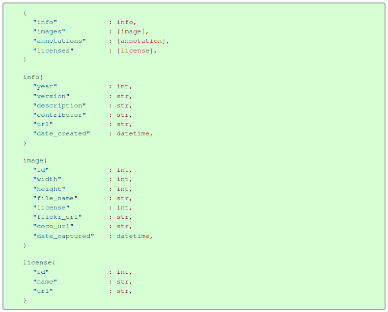

[toc]

# py-utils

## Function
1. Convert COCO annotations (i.e. json) to voc format for [`YOLOv3-tensorflow`](https://github.com/YunYang1994/tensorflow-yolov3) (i.e. txt file and each line representing an image.)
2. Statistic the frequency of different objects.


## Usage

### 1. Convert COCO annotations to VOC format
```bash
python coco2pascal.py
```

Analysis:
1. `coco.imgToAnns` is a dictionary, with key the `img_id` and value the `anns` for that image. Only images in this key set has annotations.
2. `coco.anns` is annotations in all images, and each annotation is an object.

Note:

1. The parameters in `coco2pascal.py` file can be changed according to specific images and annotations directory.


### 2. Statistic the frequencies of each class


## Explanation
### 1. Data Format
#### COCO and [Data Format](https://cocodataset.org/#format-data)
> As written in the [original research paper](https://arxiv.org/abs/1405.0312), there are 91 object categories in COCO. However, only 80 object  categories of labeled and segmented images were released in the first  publication in 2014. Currently there are two releases of COCO dataset  for labeled and segmented images. After the 2014 release, the subsequent release was in 2017. The COCO dataset is available for download from  the [download page](http://cocodataset.org/#download).

```
dataset/
	|--> coco-labels-paper.txt		# 91 classes in the original paper
	|--> coco-labels-2014-2017.txt	# 80 classes labeled in the COCO dataset, name with space
```


COCO 有几种不同的标记类型，分别对应 object detection, keypoint detection, stuff segmentation, panoptic segmentation, densepose, and image captioning. The annotations are stored using JSON. 
COCO 对于不同的任务有不同的标记类型，但都遵循相同的结构，并且标记文件都保存在 JSON 文件中。
All annotations share the same basic data structure below:
下面是 annotations 文件的统一结构：

* Annotations file 的基本结构类似与 python 中的 dict 结构，包括四个 key-value 对，如下所示：

```json
{
    "info": info,
    "images": [image],
    "annotations": [annotation],
    "licenses": [license],
}
```

* `"images": [image]` 是一个 list，每个元素代表一张 image，包括 id, width, height, file_name, coco_url 等等。
* `"annotations": [annotation]` 是一个 list，每个 `annotation` element 对应一个 object 的标注信息，比如这个 object 对应的 image，bbox 信息等等；对于每种 task，标注信息又有些区别。
* `info` and `[license]` are not important information. 其中 "info" 定义一些数据库信息，比如本版，年份等等。




The data structure specific to the various annotation types are described below:

#### COCO for Object Detection
* Each object instance `annotation` contains a series of fields, including the category id and segmentation mask of the object. 每个 `annotation` (注意，不加 `s`，说明这是对应一张 image 的标注) 包含了一些列 fields，比如 类别 ID 等等。
* In addition, an `enclosing bounding box` is provided for **each object** (box coordinates are measured from the top left image corner and are 0-indexed).
* The categories field of the annotation structure stores the mapping of category id to category and supercategory names.

```
annotation {
    "id" : int,                         # ID, the "id" is to uniquely identify each annotation
    "image_id" : int,                   # Useful for object detection.
    "category_id" : int,
    "segmentation" : RLE or [polygon],
    "area" : float,
    "bbox" : [x,y,width,height],        # A list of `x,y,width,height`, corresponding to each object. 
    "iscrowd" : 0 or 1,
}

categories[{
    "id" : int,
    "name" : str,
    "supercategory" : str,
}]
```

对于 `val2017`，有 5000 image，但是却有 36781 anno。所以 一个 anno 对应的是 5000 image 中的一个 object。
image 与 anno 的对应信息通过 `imgToAnns` 定义。

#### 关于几个 `id` 的理解
* 每个 anno 都有两个 id，一个是 `"id"`, 另一个是 `"image_id"`;
    * 其中 `"id"` 用于标记每个 object 的 anno。
    * 其中 `"image_id"` 用于标记这个 anno 属于哪一张 image。 
* 每张 image 都由自身的 `"id"` 标记， `coco.imgs[img[id]] = img`


#### COCO API 结果

```python
Categories:
 {1: {'supercategory': 'person', 'id': 1, 'name': 'person'}, 2: {'supercategory': 'vehicle', 'id': 2, 'name': 'bicycle'}, 3: {'supercategory': 'vehicle', 'id': 3, 'name': 'car'}, 4: {'supercategory': 'vehicle', 'id': 4, 'name': 'motorcycle'}, 5: {'supercategory': 'vehicle', 'id': 5, 'name': 'airplane'}, 6: {'supercategory': 'vehicle', 'id': 6, 'name': 'bus'}, 7: {'supercategory': 'vehicle', 'id': 7, 'name': 'train'}, 8: {'supercategory': 'vehicle', 'id': 8, 'name': 'truck'}, 9: {'supercategory': 'vehicle', 'id': 9, 'name': 'boat'}, 10: {'supercategory': 'outdoor', 'id': 10, 'name': 'traffic light'}, 11: {'supercategory': 'outdoor', 'id': 11, 'name': 'fire hydrant'}, 13: {'supercategory': 'outdoor', 'id': 13, 'name': 'stop sign'}, 14: {'supercategory': 'outdoor', 'id': 14, 'name': 'parking meter'}, 15: {'supercategory': 'outdoor', 'id': 15, 'name': 'bench'}, 16: {'supercategory': 'animal', 'id': 16, 'name': 'bird'}, 17: {'supercategory': 'animal', 'id': 17, 'name': 'cat'}, 18: {'supercategory': 'animal', 'id': 18, 'name': 'dog'}, 19: {'supercategory': 'animal', 'id': 19, 'name': 'horse'}, 20: {'supercategory': 'animal', 'id': 20, 'name': 'sheep'}, 21: {'supercategory': 'animal', 'id': 21, 'name': 'cow'}, 22: {'supercategory': 'animal', 'id': 22, 'name': 'elephant'}, 23: {'supercategory': 'animal', 'id': 23, 'name': 'bear'}, 24: {'supercategory': 'animal', 'id': 24, 'name': 'zebra'}, 25: {'supercategory': 'animal', 'id': 25, 'name': 'giraffe'}, 27: {'supercategory': 'accessory', 'id': 27, 'name': 'backpack'}, 28: {'supercategory': 'accessory', 'id': 28, 'name': 'umbrella'}, 31: {'supercategory': 'accessory', 'id': 31, 'name': 'handbag'}, 32: {'supercategory': 'accessory', 'id': 32, 'name': 'tie'}, 33: {'supercategory': 'accessory', 'id': 33, 'name': 'suitcase'}, 34: {'supercategory': 'sports', 'id': 34, 'name': 'frisbee'}, 35: {'supercategory': 'sports', 'id': 35, 'name': 'skis'}, 36: {'supercategory': 'sports', 'id': 36, 'name': 'snowboard'}, 37: {'supercategory': 'sports', 'id': 37, 'name': 'sports ball'}, 38: {'supercategory': 'sports', 'id': 38, 'name': 'kite'}, 39: {'supercategory': 'sports', 'id': 39, 'name': 'baseball bat'}, 40: {'supercategory': 'sports', 'id': 40, 'name': 'baseball glove'}, 41: {'supercategory': 'sports', 'id': 41, 'name': 'skateboard'}, 42: {'supercategory': 'sports', 'id': 42, 'name': 'surfboard'}, 43: {'supercategory': 'sports', 'id': 43, 'name': 'tennis racket'}, 44: {'supercategory': 'kitchen', 'id': 44, 'name': 'bottle'}, 46: {'supercategory': 'kitchen', 'id': 46, 'name': 'wine glass'}, 47: {'supercategory': 'kitchen', 'id': 47, 'name': 'cup'}, 48: {'supercategory': 'kitchen', 'id': 48, 'name': 'fork'}, 49: {'supercategory': 'kitchen', 'id': 49, 'name': 'knife'}, 50: {'supercategory': 'kitchen', 'id': 50, 'name': 'spoon'}, 51: {'supercategory': 'kitchen', 'id': 51, 'name': 'bowl'}, 52: {'supercategory': 'food', 'id': 52, 'name': 'banana'}, 53: {'supercategory': 'food', 'id': 53, 'name': 'apple'}, 54: {'supercategory': 'food', 'id': 54, 'name': 'sandwich'}, 55: {'supercategory': 'food', 'id': 55, 'name': 'orange'}, 56: {'supercategory': 'food', 'id': 56, 'name': 'broccoli'}, 57: {'supercategory': 'food', 'id': 57, 'name': 'carrot'}, 58: {'supercategory': 'food', 'id': 58, 'name': 'hot dog'}, 59: {'supercategory': 'food', 'id': 59, 'name': 'pizza'}, 60: {'supercategory': 'food', 'id': 60, 'name': 'donut'}, 61: {'supercategory': 'food', 'id': 61, 'name': 'cake'}, 62: {'supercategory': 'furniture', 'id': 62, 'name': 'chair'}, 63: {'supercategory': 'furniture', 'id': 63, 'name': 'couch'}, 64: {'supercategory': 'furniture', 'id': 64, 'name': 'potted plant'}, 65: {'supercategory': 'furniture', 'id': 65, 'name': 'bed'}, 67: {'supercategory': 'furniture', 'id': 67, 'name': 'dining table'}, 70: {'supercategory': 'furniture', 'id': 70, 'name': 'toilet'}, 72: {'supercategory': 'electronic', 'id': 72, 'name': 'tv'}, 73: {'supercategory': 'electronic', 'id': 73, 'name': 'laptop'}, 74: {'supercategory': 'electronic', 'id': 74, 'name': 'mouse'}, 75: {'supercategory': 'electronic', 'id': 75, 'name': 'remote'}, 76: {'supercategory': 'electronic', 'id': 76, 'name': 'keyboard'}, 77: {'supercategory': 'electronic', 'id': 77, 'name': 'cell phone'}, 78: {'supercategory': 'appliance', 'id': 78, 'name': 'microwave'}, 79: {'supercategory': 'appliance', 'id': 79, 'name': 'oven'}, 80: {'supercategory': 'appliance', 'id': 80, 'name': 'toaster'}, 81: {'supercategory': 'appliance', 'id': 81, 'name': 'sink'}, 82: {'supercategory': 'appliance', 'id': 82, 'name': 'refrigerator'}, 84: {'supercategory': 'indoor', 'id': 84, 'name': 'book'}, 85: {'supercategory': 'indoor', 'id': 85, 'name': 'clock'}, 86: {'supercategory': 'indoor', 'id': 86, 'name': 'vase'}, 87: {'supercategory': 'indoor', 'id': 87, 'name': 'scissors'}, 88: {'supercategory': 'indoor', 'id': 88, 'name': 'teddy bear'}, 89: {'supercategory': 'indoor', 'id': 89, 'name': 'hair drier'}, 90: {'supercategory': 'indoor', 'id': 90, 'name': 'toothbrush'}}

```


### 2. VOC for YOLOv3

annotation
    folder
    filename: 000005.jpg
    source
    owner
    size: 
        width:
        height:
        depth:
    segmented:
    object:
        name:
        bndbox:
            xmin
            ymin
            xmax
            ymax
    object:
    object:

YOLOv3 need:

```
image_path x_min, y_min, x_max, y_max, class_id  x_min, y_min ,..., class_id 
```

- [x] image_path
- [x] x_min, y_min, x_max, y_max
- [x] class_id


### 3. 关于 class id

* [What Object Categories / Labels Are In COCO Dataset?](https://tech.amikelive.com/node-718/what-object-categories-labels-are-in-coco-dataset/)
* [amikelive/coco-labels](https://github.com/amikelive/coco-labels)
* [JackLongKing](https://github.com/cocodataset/cocoapi/issues/59#issuecomment-315663672)
* [kenrobio](https://github.com/cocodataset/cocoapi/issues/272#issuecomment-628393716)
* [Data format](https://cocodataset.org/#format-data)
* [cocodataset](https://github.com/cocodataset)/**[cocoapi](https://github.com/cocodataset/cocoapi)** 


### 4. Statistic and choose the top 20

- [ ] 统计 COCO 数据库中，80 个 classes 中出现频率最高的 20 classes。在生成的训练需要的 VOC format annotations 的时候，只寻则出现频率最高的 20 classes。

```
`dict = {class_id: [class_name, freq]}`
```


## Reference

* [Data format](https://cocodataset.org/#format-data)
* [COCO API](https://github.com/cocodataset/cocoapi)
* [Difference between image_id and id in annotation key of coco annotation format #95](https://github.com/cocodataset/cocoapi/issues/95)
* [Create COCO Annotations From Scratch](https://www.immersivelimit.com/tutorials/create-coco-annotations-from-scratch)
* 